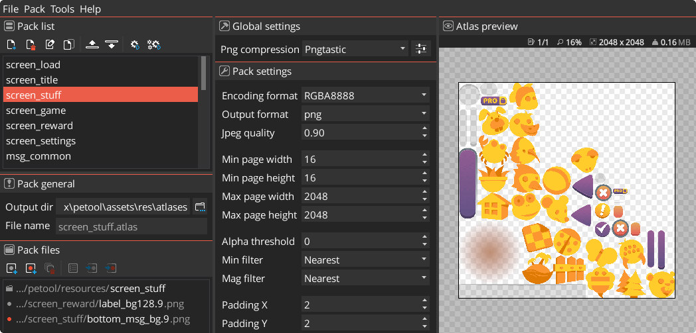
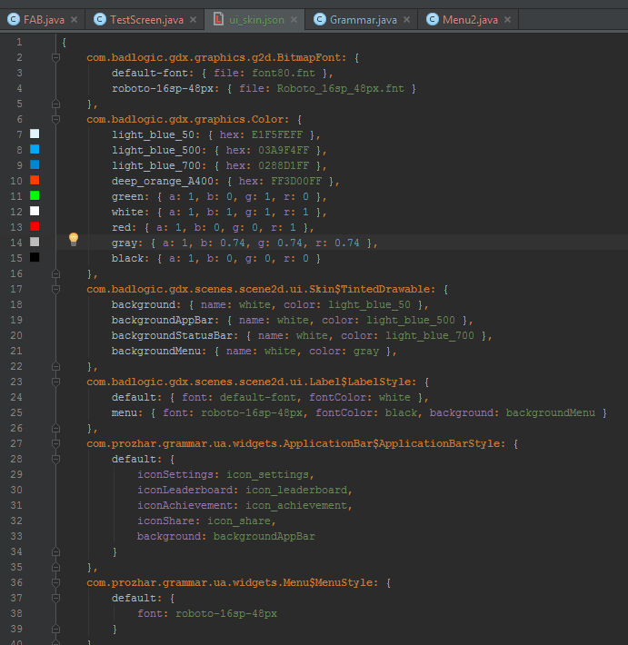
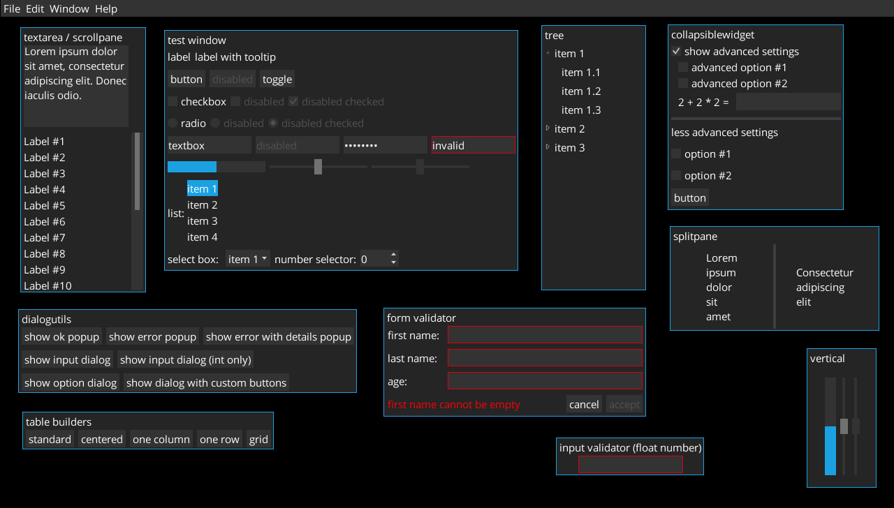
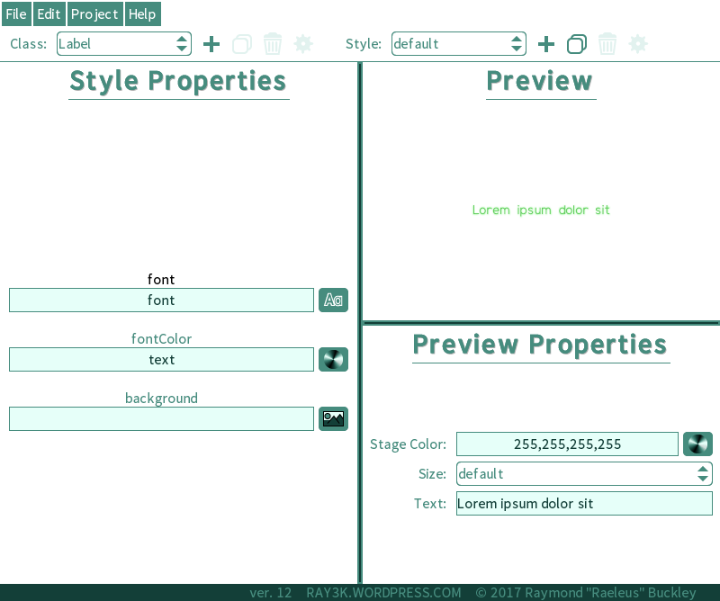
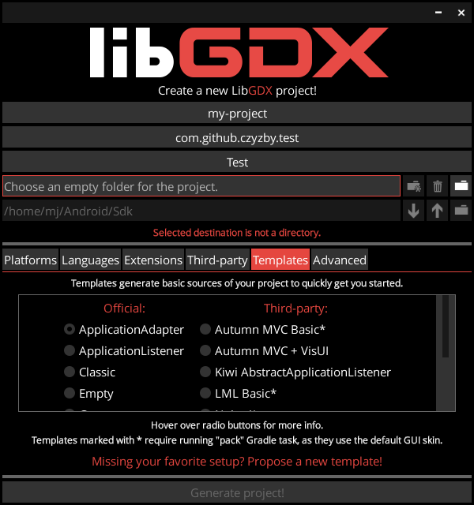

# LibGDX skins

**LibGDX** comes with a *Scene2D* GUI module, which allows you to easily create your GUIs and customize them with `Skin`
instances. However, most beginners struggle with a problem: the GUI comes without a default skin, which makes it difficult
to test it.

One could argue that it's the right approach, as it keeps framework's core `jar` smaller - but when you're trying to
learn a new thing, *something* is generally better than *nothing*.

This repository contains *something*.

### [**DOWNLOAD. ALL OF THEM.**](https://github.com/czyzby/gdx-skins/archive/master.zip)

### Free assets

You've probably stumbled upon the [default LibGDX skin](default), which was originally created to test *Scene2D* API in
the official LibGDX repository. It's alright, if you want to test things out - but by the time you're making an actual
LibGDX application, you're probably better off with something less *programmer-art*-ish.

This repository collects free skins collected or contributed by various users. Most can be used free of charge.

Note that some of the included skins might be out of date or incompatible with the latest LibGDX releases. However,
most skins include the raw resources and links to the original uploads in the `README` files - if you're interested
in a particular skin, make sure you're using up-to-date assets. This repository includes duplicates the skin files
for two reasons: original uploads might expire (or be moved) and it's very convenient to download them all at once
to try each one out.

## Additional resources

If you're learning *Scene2D* API, make sure to check out these resources.

### Unofficial tools you might not know about

[Texture Packer GUI](https://github.com/crashinvaders/gdx-texture-packer-gui) allows to create texture atlases from
multiple images. It provides a graphical interface for [the official texture packer tool](https://libgdx.com/wiki/tools/texture-packer).

[IntelliJ LibGDX plugin](https://github.com/BlueBoxWare/LibGDXPlugin) adds multiple useful LibGDX code inspections and
editors for *Scene2D*-related files (atlases, skins, fonts).

[VisUI library](https://github.com/kotcrab/vis-editor/wiki/VisUI) extends *Scene2D* with custom widgets and some default
skins. Even if you don't like its default theme (or flat design in general), consider including this library for its
useful new actors.

[Skin Composer](https://github.com/raeleus/skin-composer) is a graphical application that allows you to create and edit
custom `Scene2D` skins.

[`gdx-liftoff` application](https://github.com/tommyettinger/gdx-liftoff) allows to create LibGDX projects. Additionally
to most features provided by the official setup application, it allows to include other JVM languages, more third-party
libraries and generate code with one of predefined project templates.

### Helpful articles

- [Official Scene2D article](https://libgdx.com/wiki/graphics/2d/scene2d/scene2d).
[Scene2D UI](https://libgdx.com/wiki/graphics/2d/scene2d/scene2d-ui) and [`Table`](https://libgdx.com/wiki/graphics/2d/scene2d/table)
pages are worth your time as well.
- [Official `Skin` article](https://libgdx.com/wiki/graphics/2d/scene2d/skin).
- [Official texture packer](https://libgdx.com/wiki/tools/texture-packer) and
[Hiero tool](https://libgdx.com/wiki/tools/hiero) articles, both of which are useful when preparing `Skin` assets. 
- [Official ninepatches article](https://libgdx.com/wiki/graphics/2d/ninepatches) might help you understand how to
make skins that look well when resized.
- [This article](https://rskupnik.github.io/libgdx-ui-overview) is an amazing introduction into LibGDX GUI tools.
- [GamesFromScratch blog](http://www.gamefromscratch.com/post/2013/11/27/LibGDX-Tutorial-9-Scene2D-Part-1.aspx) includes
a multi-part *Scene2D* tutorial.
- [Pimentoso Software blog](http://pimentoso.blogspot.com/2013/04/libgdx-scene2d-skin-quick-tutorial.html) contains
a simple *Scene2D* tutorial.

### Useful libraries

- The [KTX libraries](https://github.com/libktx/ktx) contain [Kotlin](http://kotlinlang.org/) utilities for building
*Scene2D* styles and widgets. Its [`ktx-style`](https://github.com/libktx/ktx/tree/master/style) module can be
a great alternative to error-prone `.json` skin files, and the powerful Scene2D DSL from
[`ktx-scene2d`](https://github.com/libktx/ktx/tree/master/scene2d) replaces the overly verbose Java GUI building code.
- The [USL library](https://github.com/kotcrab/vis-ui/wiki/USL) allows you to create Skin *JSON* files thanks to its simplified,
less boilerplate-ish and more powerful syntax. `.usl` files are meant be compiled to LibGDX `.json` skin definitions before
deploying the application - there is no runtime overhead.

### Tools you might have stumbled upon, but should not use

- **Do NOT use [graphical texture packer](https://code.google.com/archive/p/libgdx-texturepacker-gui/)**, unless dealing
with legacy LibGDX version: it is not up-to-date and **can produce corrupt atlases** due to its texture packer version.
You're much better off setting up a Gradle task using the latest `gdx-tools` to pack your atlases (see official texture
packer article for more info how to do this) or using the new [Texture Packer GUI](https://github.com/crashinvaders/gdx-texture-packer-gui).
- [gdx-skineditor](https://github.com/cobolfoo/gdx-skineditor) is a graphical tool that allows to create `Skin` files.
It is not actively maintained, seems to be missing a few features and is known to crash.
Use [Skin Composer](https://github.com/raeleus/skin-composer) instead.

## Contributing

Maintainer will gladly accept any pull requests with additional resources - not only new skins, but also useful links
and texts. Helping with keeping skin files up-to-date is also appreciated: don't hesitate to leave an issue or create
a pull request if any resources are outdated.

LibGDX team created their own [similar community-driven project](https://github.com/libgdx/libgdx-skins) featuring
live preview, but it seems to contain far less resources overall. Consider uploading your assets to their repository
as well.
