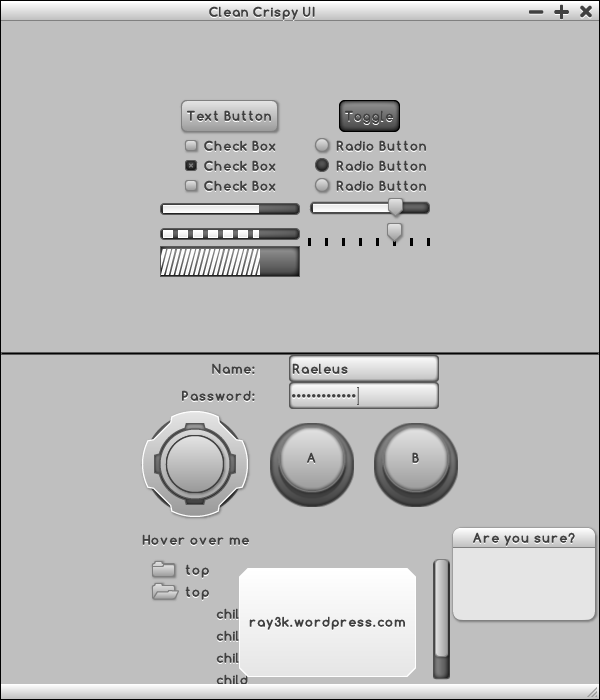

# Clean Crispy UI

```
Clean Crispy UI Ver. 1

Created by Raymond "Raeleus" Buckley
Visit ray3k.wordpress.com for games, tutorials, and much more!
© Copyright 2016 Raymond Buckley

Comfortaa Font used under SIL OPEN FONT LICENSE Version 1.1
Copyright (c) 2010, Johan Aakerlund (aajohan@gmail.com),
with Reserved Font Name "Comfortaa".
See "Comfortaa Font License.txt"

Clean Crispy UI can be used under the CC BY license.
http://creativecommons.org/licenses/by/4.0/
```

Features styles of most of **Scene2D** widgets. Simple and readable. Can be easily recolored by modifing color properties in `.json` file.



### About

Created with [Skin Composer](https://github.com/raeleus/skin-composer) by [**Raeleus**](https://ray3k.wordpress.com/clean-crispy-ui-skin-for-libgdx/).

### License
[CC BY 4.0](http://creativecommons.org/licenses/by/4.0/). Give credit to [***Raymond "Raeleus" Buckley***](https://ray3k.wordpress.com/software/skin-composer-for-libgdx/).
