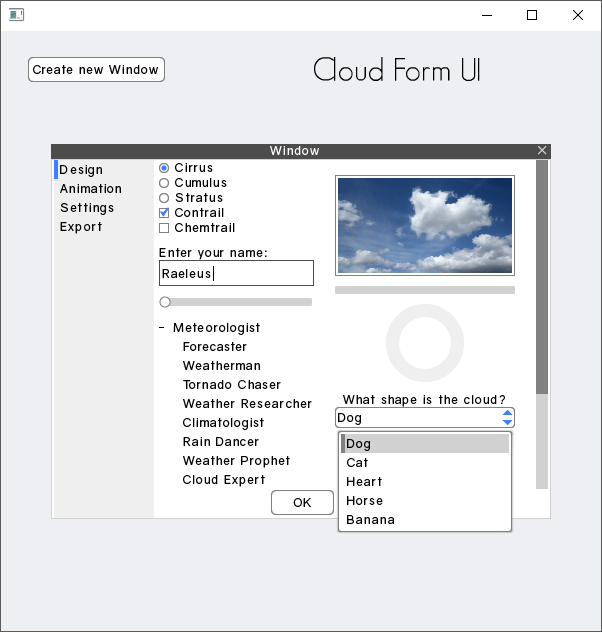

# Cloud Form UI

```
Cloud Form UI Ver. 1

Created by Raymond "Raeleus" Buckley
Visit ray3k.wordpress.com for games, tutorials, and much more!
© Copyright 2016 Raymond Buckley

Cloud Form UI can be used under the CC BY license.
http://creativecommons.org/licenses/by/4.0/

RadialDrawable.java can be used under the MIT license.
https://opensource.org/licenses/MIT

RadialProgressBar.java can be used under the Apache 2.0 license.
Derived from ProgressBar class by mzechner and Nathan Sweet. Added RadialDrawable functionality and removed all use of Drawable knobs.
http://www.apache.org/licenses/LICENSE-2.0

Gravity font by Vincenzo Vuono
© Vincenzo Vuono www.vincenzovuono.com
Used under the CC BY license.
http://creativecommons.org/licenses/by/4.0/
```

Features styles of most of **Scene2D** widgets. Simplistic UI in style of (corporate) desktop applications. [Example project](https://ray3k.wordpress.com/cloud-form-ui-skin-for-libgdx/) contains example implementation of a radial progress bar.



### About

Created with [Skin Composer](https://github.com/raeleus/skin-composer) by [**Raeleus**](https://ray3k.wordpress.com/cloud-form-ui-skin-for-libgdx/).

### License
[CC BY 4.0](http://creativecommons.org/licenses/by/4.0/). See the quote above for more data. Give credit to [***Raymond "Raeleus" Buckley***](https://ray3k.wordpress.com/software/skin-composer-for-libgdx/) and [Vincenzo Vuono](http://www.vincenzovuono.com) if you use the fonts.
