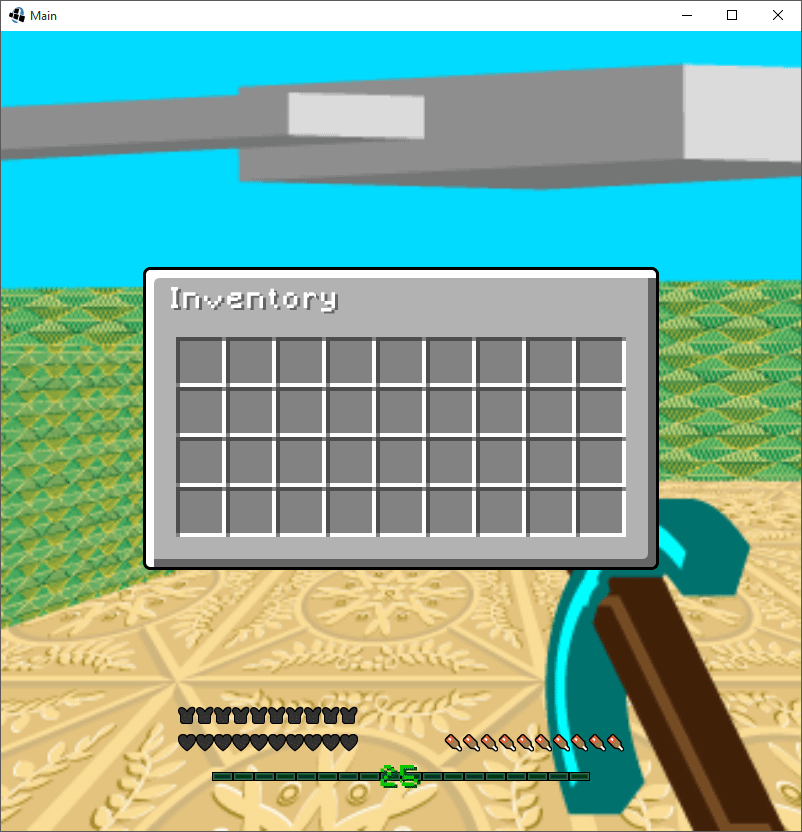

# Craftacular UI

```
Craftacular UI Ver. 1

Created by Raymond "Raeleus" Buckley
Visit ray3k.wordpress.com for games, tutorials, and much more!

Craftacular UI can be used under the CC BY license.
http://creativecommons.org/licenses/by/4.0/
```

Features styles of most of **Scene2D** widgets. For all those of you who want (*or need*) to make a Minecraft-ish GUI.




### About

Created with [Skin Composer](https://github.com/raeleus/skin-composer) by [**Raeleus**](https://ray3k.wordpress.com/craftacular-ui-skin-for-libgdx/).

### License
[CC BY 4.0](http://creativecommons.org/licenses/by/4.0/). Give credit to [***Raymond "Raeleus" Buckley***](https://ray3k.wordpress.com/software/skin-composer-for-libgdx/).
