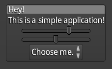
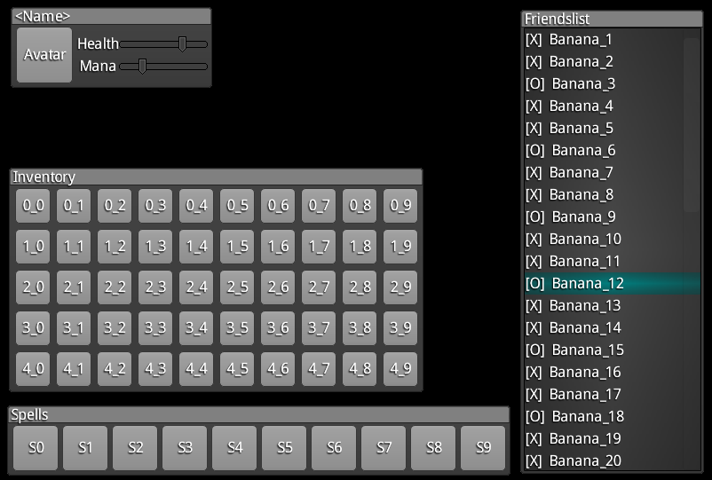

# LibGDX default skin

The one, the only, [*the default one*](https://github.com/libgdx/libgdx/tree/master/tests/gdx-tests-android/assets/data).

Majority of LibGDX devs started with this skin, as it's easy to find with ~~Goog~~ your search engine of choice. And, well, it *works*.

Supports most of the **Scene2D** widgets (including the newest tooltips), with notable exceptions being the image buttons. Features no additional icons, so if you want fancy controls for turning music on and off, you might want to [modify it](https://github.com/libgdx/libgdx/tree/master/tests/gdx-tests-android/assets-raw/skin).

Preview taken from [LibGDX skins](https://github.com/libgdx/libgdx-skins):

### License

Seems to be the same as the whole **LibGDX** framework. But then again - in commercial products, you might want to try out something fancier.
