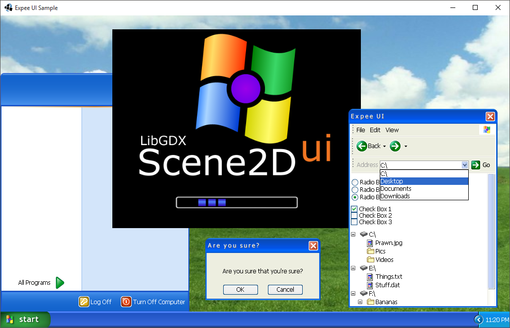

# Expee UI

```
Expee UI Ver. 1

Created by Raymond "Raeleus" Buckley
Visit ray3k.wordpress.com for games, tutorials, and much more!

Expee UI can be used under the CC BY license.
https://creativecommons.org/licenses/by-sa/2.0/

Rolling_Hills_-_geograph.org.uk_-_434125.jpg by Stuart Brabbs:
http://www.geograph.org.uk/profile/14097
Used under the Creative Commons Attribution-Share Alike 2.0 Generic license.
```

Features styles of most common **Scene2D** widgets. Citing the author:

> Relive the silver age of computing when operating systems were real operating systems! This skin has been inspired by the Windows XP OS. I created the images myself and they are not ripped from the source. This could be used as a fake desktop in a computer simulation or the base for something more advanced.



You can find an example project [here](https://ray3k.wordpress.com/artwork/expee-ui-skin-for-scene2d-ui/).

### License
[CC BY-SA 2.0](https://creativecommons.org/licenses/by-sa/2.0/). Give credit to [***Raymond "Raeleus" Buckley***](http://www.badlogicgames.com/forum/viewtopic.php?f=22&t=22887).
