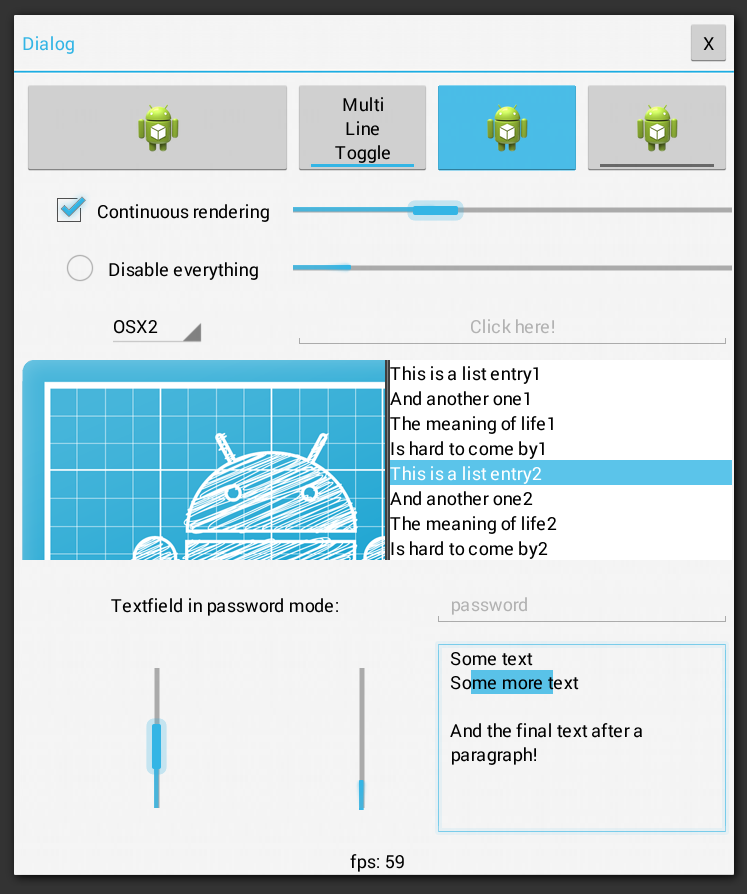

# [Android Holo Theme](https://github.com/nooone/gdx-holo)

This is an [alternative](../holo) skin based on the Android Holo theme. Simplistic and elegant.
 

Seems to support all LibGDX widgets, including the new text tooltip. [Raw](raw) assets include a [USL](https://github.com/kotcrab/vis-editor/wiki/USL) skin file, which can be used to generate a standard JSON skin definition. You can check for updates in its [repository](https://github.com/nooone/gdx-holo).

### License

Give credit to [Daniel Holderbaum](https://github.com/nooone).

