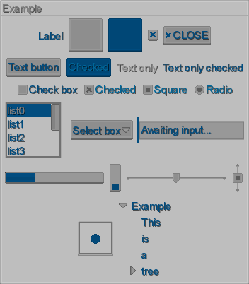
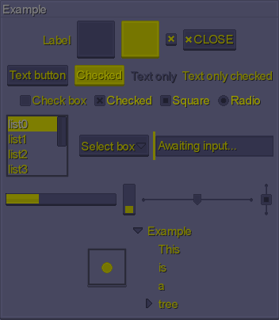

# Kenney Pixel Theme

This skin was based on free pixel art GUI assets created by the amazing [Kenney](http://kenney.nl/). The goal was to create a highly customizable skin, which would require a few lines of code to modify - rather than hours in image editors.



Thanks to its pixel-art*-ish* nature, it can be be easily scaled by *2, 3, 4* and so on, and still look pretty good.

The atlas drawables are originally white - rather than providing assets in a specific color theme, this skin allows you to tint them however you like at runtime thanks to the `TintedDrawable` utility. All you have to do is modify the `Color` values (or `TintedDrawables` directly, if you want even more control) in `skin.json`:
```
        com.badlogic.gdx.graphics.Color: {
          white: { r: 1, g: 1, b: 1, a: 1 },
          gray: { r: 0.5, g: 0.5, b: 0.5, a: 1 },
          black: { r: 0, g: 0, b: 0, a: 1 },
          
          up: { r: 0.6, g: 0.6, b: 0.6, a: 1 },
          over: { r: 0.5, g: 0.5, b: 0.5, a: 1 },
          down: { r: 0, g: 0.3, b: 0.5, a: 1 },
          checked: { r: 0, g: 0.3, b: 0.5, a: 1 },
          checkedOver: { r: 0, g: 0.4, b: 0.6, a: 1 },
          disabled: { r: 0.1, g: 0.1, b: 0.1, a: 1 },
          background: { r: 0.8, g: 0.8, b: 0.8, a: 1 },
          selection: { r: 0, g: 0.3, b: 0.5, a: 1 },
          semiTransparent: { r: 0, g: 0, b: 0, a: 0.6 },
          
          font: down
          fontOver: down
          fontDown: gray
          fontChecked: checkedOver
          fontCheckedOver: checked
          fontDisabled: gray
        }
```

This is very convenient, as you can quickly try out different GUI themes without actually changing a single image.



### Notes

- All default **Scene2D** actors are supported.
- This will **NOT** work on the Android by default, as Android does not support classpath fonts loading. If you target Android, copy `arial-15.fnt` and `arial-15.png` from `com.badlogic.gdx.utils` package (in the main LibGDX jar) to `com/badlogic/gdx/utils` folder in your `assets` directory. Or - even better - add a custom font and replace the one in `skin.json`.
- Additional GUI icons are not provided. However, you can use the [raw assets](raw) to add your custom icons and repack the atlas.
- The assets were designed to be shown in pretty light palette. Keep in mind that if your theme colors are too dark, some details might be difficult to see. For example, it could be hard to determine if a check box is checked or not. If you really want a black(ish) skin, you can try "inverting" the colors of the original images: while they should all still be nearly white, keep the outlines *lighter* than the rest.
- A custom font is **not** included. While the images scale very nicely, the default **LibGDX** font is **not** pixel art and will not look so crispy when scaled up. Providing a custom font should be the first thing you'd generally want to do.
- Most actors with optional backgrounds (like `Tree`, `ScrollPane`, `List`) feature at least two styles: `default` (without any background) and `background`.
- Previews were created using [LML](https://github.com/czyzby/gdx-lml/tree/master/lml). In [raw assets folder](raw/extras) you can find the LML template used to create the previews, as well as the settings of the darker theme.
- Thanks to the fact that drawables are created at runtime, this skin allows you to prepare very responsive widgets that change their look when hovered, clicked, checked, disabled and so on. Many skin creators do not bother with preparing so many images; in this case, it was just a matter of a few JSON lines, so it required much less work.
- *Do not expect miracles.* This simple tinting mechanism is unable to create multi-color widgets, for example. To fully customize your theme, you might need to modify the assets manually in an image editor at some point.

### License

[CC0](https://creativecommons.org/publicdomain/zero/1.0/). [Kenney](http://kenney.nl/) is the original author of the assets, while [MJ](https://github.com/czyzby) modified them and prepared the skin. While it's not necessary, you can provide a link to [Kenney's website](http://kenney.nl/) and [MJ's LibGDX libraries](https://github.com/czyzby/gdx-lml) in your credits.

