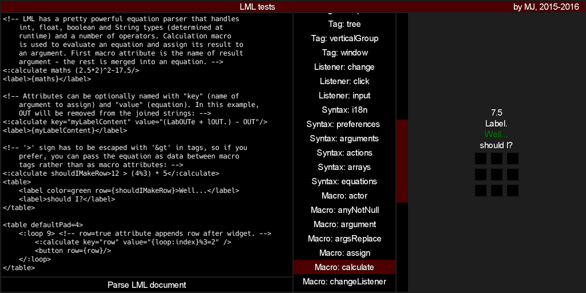

# LML theme

This is a simplistic, sorta-flat design, black-red-white(-gray) skin. It was made to showcase [LML project](https://github.com/czyzby/gdx-lml/tree/master/lml) - it is currently used in [gdx-lml-tests application](https://github.com/czyzby/gdx-lml/tree/master/examples/gdx-lml-tests), where you can find its latest version.

Supports every **Scene2D** widget. Features no additional icons - but raw assets are included, so it should be pretty easy to extend. Since it was originally designed to display code snippets, it includes [Hack font](https://github.com/chrissimpkins/Hack) - after removing it, the atlas gets ridiculously small and requires no external `.fnt` files, as this skin internally uses the `arial-15.fnt` as default font, which is shipped with the **LibGDX** core library (whether you like it or not).

### License

Everything except for the *Hack* font is licensed [CC0](https://creativecommons.org/publicdomain/zero/1.0/). You can use it without credit, although you can mention that the skin was created by **MJ** (or **Czyzby**). Posting a link to [gdx-lml](https://github.com/czyzby/gdx-lml) would also be nice.
