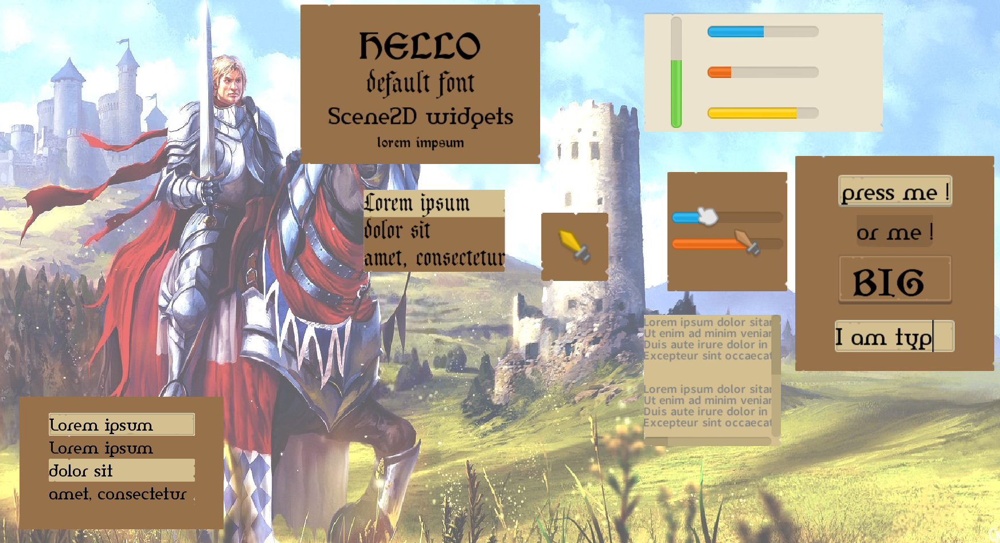

# Medieval UI

```
This skin is based on Kenney's Ui pack : http://kenney.nl/assets/ui-pack-rpg-expansion 
The second image pack I used is  (I supported Kenney and bought the first asset pack) : 
http://kenney.nl/assets/game-icons

Great site ! Modern and good structured asset packs ! 

I used RAY3K's skin composer ... https://ray3k.wordpress.com/software/skin-composer-for-libgdx/ 
Great thing ! 
```




## Description

    Simple skin. Works for me ! 
    Includes also ImageButtons with different images ! 
    
    Good advice : You can use the "gauntlet images" (included in raw directory)  and resize them to "power of two" 
    (16*16, 32*32....) and use them as cursor ! 

## License

    https://creativecommons.org/licenses/by/4.0/


