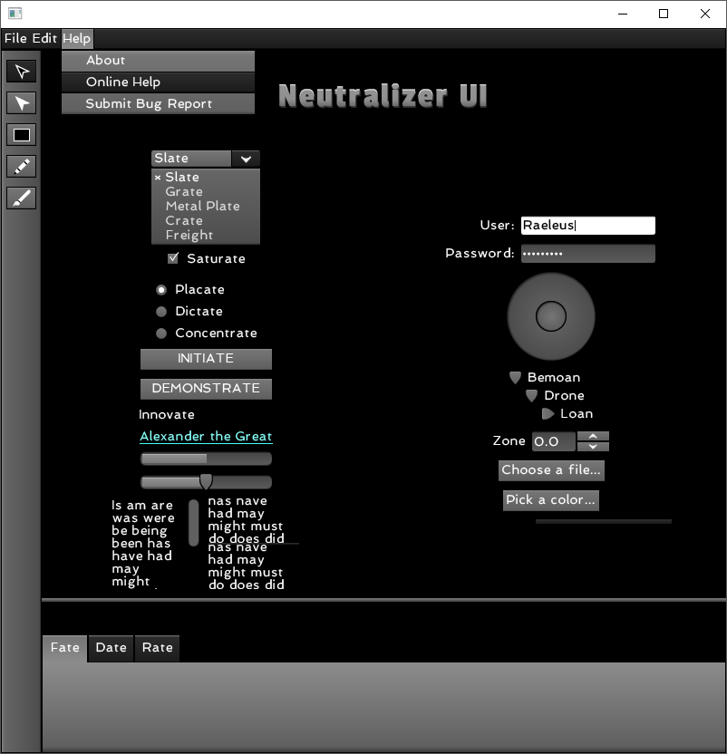
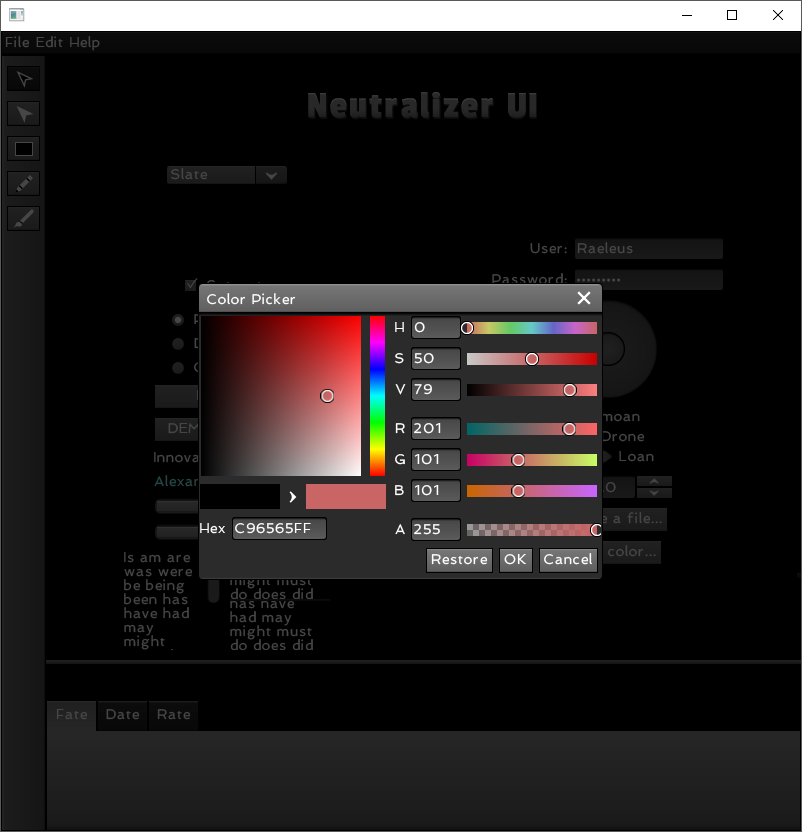
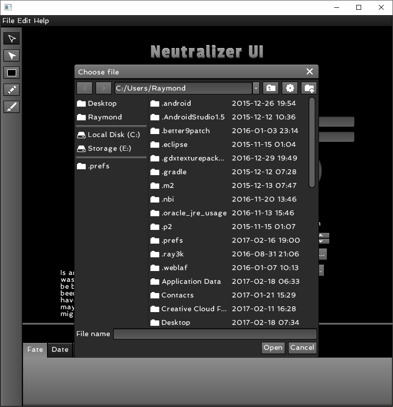

# Neutralizer UI

```
Neutralizer UI Ver. 1

Created by Raymond "Raeleus" Buckley
Visit ray3k.wordpress.com for games, tutorials, and much more!
© Copyright 2017 Raymond Buckley

Neutralizer UI can be used under the CC BY license.
http://creativecommons.org/licenses/by/4.0/
```

Features styles of most of **Scene2D** and **VisUI** widgets.



Made as a compatibility test of [Skin Composer](https://github.com/raeleus/skin-composer) and [VisUI](https://github.com/kotcrab/vis-editor/wiki/VisUI).




### About

Created with [Skin Composer](https://github.com/raeleus/skin-composer) by [**Raeleus**](https://ray3k.wordpress.com/neutralizer-ui-skin-for-visui/).

### License
[CC BY 4.0](http://creativecommons.org/licenses/by/4.0/). Give credit to [***Raymond "Raeleus" Buckley***](https://ray3k.wordpress.com/software/skin-composer-for-libgdx/). Also, see the [font](PassionOneFont.txt) [licenses](SpinnakerFont.txt).
