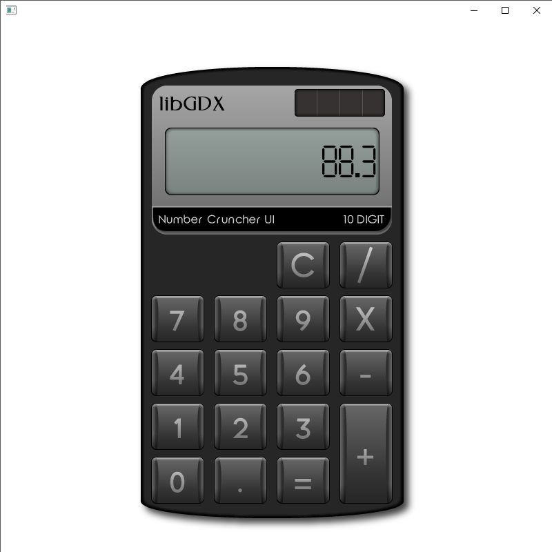

# Number Cruncher UI

```
Number Cruncher UI Ver. 1

Created by Raymond "Raeleus" Buckley
Visit ray3k.wordpress.com for games, tutorials, and much more!
© Copyright 2016 Raymond Buckley

Number Cruncher UI can be used under the CC BY license.
http://creativecommons.org/licenses/by/4.0/
```

Features styles of some **Scene2D** widgets. Perfect skin for your typical school assignment.




You can find an example project [here](https://ray3k.wordpress.com/number-cruncher-ui-skin-for-libgdx/).

### License
[CC BY 4.0](http://creativecommons.org/licenses/by/4.0/). Give credit to [***Raymond "Raeleus" Buckley***](http://www.badlogicgames.com/forum/viewtopic.php?f=22&t=22887).
