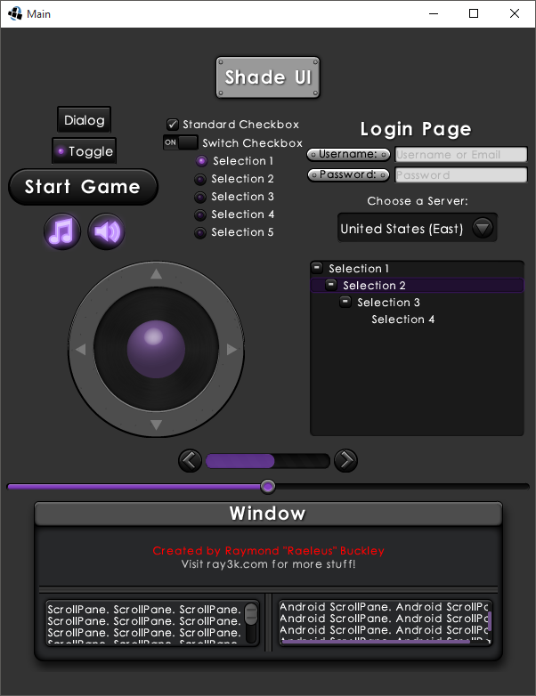
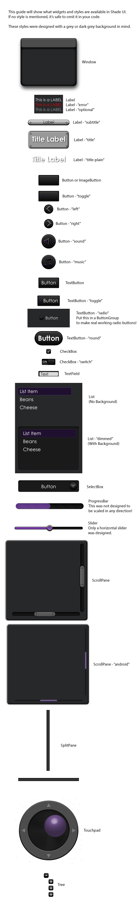

# Shade UI

```
Shade UI Ver. 1

Created by Raymond "Raeleus" Buckley
Visit ray3k.com for games, tutorials, and much more!

Shade UI can be used under the CC BY license.
http://creativecommons.org/licenses/by/4.0/
```

Features styles of most of **Scene2D** widgets. Looks kind of like the so-called *default* LibGDX skin, but updated and fancier.



### Style guide



### License
[CC BY 4.0](http://creativecommons.org/licenses/by/4.0/). Give credit to [***Raymond "Raeleus" Buckley***](http://www.badlogicgames.com/forum/viewtopic.php?f=22&t=21568).
